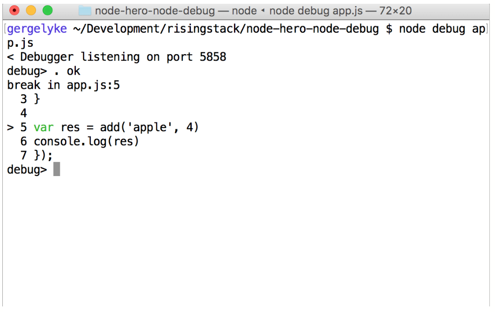

# Отладка

В этой главе вы узнаете, как отлаживать приложения Node.js с помощью модуля `debug`, встроенного отладчика Node и инструментов разработчика в Chrome.

## Баги и дебаггинг

Термины «баг» и «дебаггинг» были частью инженерного жаргона в течение многих десятилетий. Одно из первых упоминаний о багах:

> *Так было со всеми моими изобретениями. Первый шаг — интуиция, которая приходит как вспышка, затем возникают трудности — устройство отказывается работать, и именно тогда проявляются «жучки» — как называют эти мелкие ошибки и трудности — и требуются месяцы пристального наблюдения, исследований и усилий, прежде чем дело дойдёт до коммерческого успеха или неудачи.*
> ***Томас Эдисон***

## Отладка Node.js-приложений

Одним из наиболее часто используемых методов поиска проблем в приложениях Node.js является интенсивное использование `console.log` для отладки. 

> *«`Console.log` эффективен для отладки небольших фрагментов, но мы рекомендуем использовать лучшие альтернативы!»*

Давайте посмотрим на них!

## Модуль `debug`

Некоторые из наиболее популярных модулей, которые могут потребоваться в вашем проекте, поставляются с модулем `debug`. С помощью этого модуля вы можете включить сторонние модули для логирования в стандартный поток вывода — `stdout`. Чтобы проверить, использует ли его модуль, посмотрите раздел зависимости файла `package.json`.

Чтобы использовать модуль `debug`, вы должны установить переменную среды `DEBUG` при запуске вашего приложения. Вы также можете использовать символ `*` для имён модулей. Следующая настройка будет выводить все логи, связанные с express, в стандартный поток вывода.

```
DEBUG=express* node app.js
```

Вывод в консоль будет выглядеть так:


## Встроенный отладчик Node.js

> Node.js включает полнофункциональную утилиту для отладки вне процесса, доступную с помощью простого протокола, основанного на TCP и встроенного клиента.

Чтобы запустить встроенный отладчик, вы должны запустить приложение следующим образом:

```
node debug app.js
```

Как только вы это сделаете, вы увидите что-то вроде этого:



## Базовое использование отладчика Node.js

Для навигации по интерфейсу вы можете использовать следующие команды:

* `c` => продолжить выполнение кода
* `n` => выполнить эту строку и перейти к следующей строке
* `s` => войти в эту функцию
* `o` => закончить выполнение функции и выйти наружу
* `repl` => позволяет удаленно выполнить код

Вы можете добавить точки останова в свои приложения, вставив инструкцию `debugger` в свой код.

```javascript
function add (a, b) {
    debugger
    return a + b
}

var res = add('apple', 4)
```

## Вотчеры

> *Во время отладки можно наблюдать за изменением значений выражений и переменных. В каждой точке останова каждое выражение из списка наблюдаемых будет исполняться в текущем контексте и отображаться непосредственно перед списком точек останова.*

Чтобы начать использовать вотчеры, вы должны определить их для выражений, за значениями которых вы хотите наблюдать. Это можно сделать следующим образом:

```javascript
watch('expression')
```

Чтобы получить список активных вотчеров наберите `watchers`, чтобы перестать отслеживать выражение используйте `unwatch('expression')`.

> *Подсказка для профессионалов: вы можете переключать процессы Node.js в режим отладки, отправив им команду `SIGUSR1`. После этого вы можете подключить отладчик с помощью `debug -p <pid>`.*
 
*Чтобы понять все возможности встроенного отладчика, ознакомьтесь с официальной документацией API: [https://nodejs.org/api/debugger.html](https://nodejs.org/api/debugger.html).*

## Отладчик Chrome

Когда вы начинаете отладку сложных приложений, что-то более визуальное может неплохо помочь. Было бы хорошо использовать знакомый пользовательский интерфейс Chrome DevTools для отладки Node.js приложений, не правда ли?


Хорошие новости, протокол отладки Chrome уже портирован в Node.js и может использоваться для отладки Node.js-приложений.

Чтобы начать его использовать, вам необходимо сначала установить `node-inspector`:

```
npm install -g node-inspector
```

После его установки вы можете начать отладку своих приложений, запустив их следующим образом:

```
node-debug index.js --debug-brk
```

*(`-debug-brk` приостанавливает выполнение на первой строке)*

`node-inspector` откроет Chrome DevTools, и вы можете приступить к отладке своего Node.js-приложения.

*Примечание переводчика: начиная с Node.js 6 интеграция с  Chrome DevTools встроена в ядро. Для отладки необходимо запустить приложение с ключом `--inspect`.*

---

В следующей главе Node Hero вы узнаете, **как защитить ваши Node.js-приложения**.
