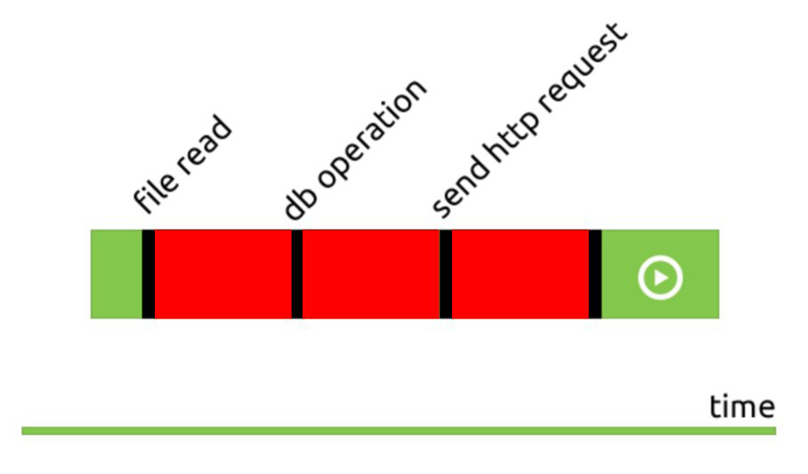

# ПОНИМАНИЕ АСИНХРОННОГО ПРОГРАММИРОВАНИЯ

В этой главе я расскажу вам о принципах асинхронного программирования и покажу, как создавать асинхронные операции в JavaScript и Node.js.

## Синхронное программирование

В традиционной практике программирования большинство операций ввода-вывода происходит синхронно. Если вы думаете о Java и о том, как вы читаете файл в  Java, вы получите что-то вроде этого:

```java
try(FileInputStream inputStream = new FileInputStream(“foo.txt”)) {
	Session IOUtils;
	String  fileContent = IOUtils.toString(inputStream); 
}
```

Что происходит в фоновом режиме? Основной поток будет заблокирован до тех пор, пока файл не будет прочитан, а это означает, что за это время ничего другого не может быть сделано. Чтобы решить эту проблему и лучше использовать ваш CPU, вам придется управлять потоками вручную.

Если у вас больше блокирующих операций, очередь событий становится еще хуже:



*(Красные полосы отображают промежутки времени, в которые процесс ожидает ответа от внешнего ресурса и блокируется, черные полосы показывают, когда ваш код работает, зеленые полосы отображают остальную часть приложения)*

Для решения этой проблемы Node.js предложила модель асинхронного программирования.

## Асинхронное программирование в Node.js

> *Асинхронный ввод-вывод — это форма обработки ввода/вывода, которая позволяет продолжить обработку других задач не ожидая завершения передачи.*

В следующем примере я покажу простой процесс чтения файлов в Node.js — как синхронным, так и асинхронным спрособом, с целью показать вам, чего вы можете достигнуть, если будете избегать блокировки ваших приложений.

Начнем с простого примера: синхронное чтение файла с использованием Node.js:

```javascript
const fs = require(‘fs’)
let content
try {
	content = fs.readFileSync(‘file.md’, ‘utf-8’)
} catch (ex) {
	console.log(ex)
}
console.log(content)
```

Что здесь происходит? Мы читаем файл, используя синхронный интерфейс модуля `fs`. Он работает как ожидалось — в переменную `content` сохраняется содержимое `file.md`. Проблема с этим подходом заключается в том, что Node.js будет заблокирована до завершения операции — это означает, что она ничего не может сделать полезного, пока читается файл.

Посмотрим, как мы можем это исправить!

Асинхронное программирование, в том виде, в каком мы знаем его в JavaScript, может быть реализовано только при условии, что функции являются объектами первого класса: они могут передаваться как любые другие переменные другим функциям. Функции, которые могут принимать другие функции в качестве аргументов, называются [функциями высшего порядка](https://blog.risingstack.com/functional-ui-and-components-as-higher-order-functions/).

Один из самых простых примеров функций высшего порядка:

```javascript
const numbers = [2,4,1,5,4]
function isBiggerThanTwo (num) {
	return num > 2
}
numbers.filter(isBiggerThanTwo)
```
В приведенном выше примере мы передаем функцию `isBiggerThanTwo` в функцию `filter`. Таким образом, мы можем определить логику фильтрации.

Так появились функции обратного вызова(*колбеки*): если вы передаете функцию другой функции в качестве параметра, вы можете вызвать ее внутри функции, когда она закончит свою работу. Нет необходимости возвращать значения, нужно только вызывать другую функцию с этими значениями.

В основе Node.js лежит принцип «первым аргументом в колбеке должна быть ошибка» - его придерживаются базовые модули, а также большинство модулей найденных в NPM.

```javascript
const fs = require(‘fs’)
fs.readFile(‘file.md’, ‘utf-8’, function (err, content) {
	if (err) {
		return console.log(err)
	}
	
	console.log(content)
})
```

Что следует здесь отметить:

• **обработка ошибок:** вместо блока `try-catch` вы проверяете ошибку в колбеке
• **отсутствует возвращаемое значение**: Асинхронные функции не возвращают значения, но значения будут переданы в колбеки

Давайте немного изменим этот файл, чтобы увидеть, как это работает на практике:

```javascript
const fs = require(‘fs’)

console.log(‘start reading a file...’)

fs.readFile(‘file.md’, ‘utf-8’, function (err, content) {
	if (err) {
		console.log(‘error happened during reading the file’)
		return console.log(err)
	}
	console.log(content)
})

console.log(‘end of the file’)
```

Результатом выполнения этого кода будет:

```
start reading a file...
end of the file
error happened during reading the file
```

Как вы можете видеть, как только мы начали читать наш файл, выполнение кода продолжилось, а приложение вывело `end of the file`. Наш колбек вызывался только после завершения чтения файла. Как это возможно?
**Встречайте цикл событий (event loop).**

## Цикл событий

Цикл событий лежит в основе Node.js и JavaScript - он отвечает за планирование асинхронных операций.

Прежде чем погрузиться глубже, давайте убедимся, что мы понимаем, что такое программирование с управлением по событиям (event-driven programming).

> Программирование с управлением по событиям представляет собой парадигму программирования, в которой поток выполнения программы определяется событиями, такими как действия пользователя (щелчки мышью, нажатия клавиш), выходы датчиков или сообщения из других программ/потоков.

На практике это означает, что приложения реагируют на события.

Кроме того, как мы уже узнали в первой главе, с точки зрения разработчика Node.js является однопоточным. Это означает, что вам не нужно иметь дело с потоками и синхронизировать их, Node.js скрывает эту сложность за абстракцией. Все, кроме кода, выполняется параллельно.

Для более глубокого понимания работы цикла событий рекомендуем посмотреть это видео:

[https://www.youtube.com/watch?v=8aGhZQkoFbQ](https://www.youtube.com/watch?v=8aGhZQkoFbQ)

## Асинхронный поток управления

Поскольку теперь у вас есть общее представление о том, как работает асинхронное программирование в JavaScript, давайте рассмотрим несколько примеров того, как вы можете организовать свой код.

### Async.js

Чтобы избежать так называемого [Callback-Hell](http://callbackhell.com/), вы можете начать использовать [async.js](https://github.com/caolan/async).

Async.js помогает структурировать ваши приложения и упрощает понимание потока управления.

Давайте рассмотрим короткий пример использования Async.js, а затем перепишем его с помощью промисов.

Следующий фрагмент перебирает три файла и выводит системную информацию по каждому:

```javascript
async.parallel([‘file1’, ‘file2’, ‘file3’], fs.stat,
function (err, results) {
	// results is now an array of stats for each file
})
```

*Примечание переводчика: если вы пользуетесь Node.js версии 7 и выше, лучше воспользоваться всроенными конструкциями языка, такими как async/await.*

### Промисы

> Объект `Promise` используется для отложенных и асинхронных вычислений. Промис представляет собой операцию, которая еще не завершена, но ожидается в будущем.
 
На практике предыдущий пример можно переписать следующим образом:

```javascript
function stats (file) {
  return new Promise((resolve, reject) => {
		fs.stat(file, (err, data) => {
			if (err) {
				return reject (err)
			}
			resolve(data)
		})
	})
}

Promise.all([
	stats(‘file1’),
	stats(‘file2’),
	stats(‘file3’)
])
.then((data) => console.log(data))
.catch((err) => console.log(err))
```

Конечно, если вы используете метод, который возвращает промис, то пример будет заметно компактнее.

---

В следующей главе вы узнаете, как *запустить ваш первый Node.js HTTP-сервер*.
