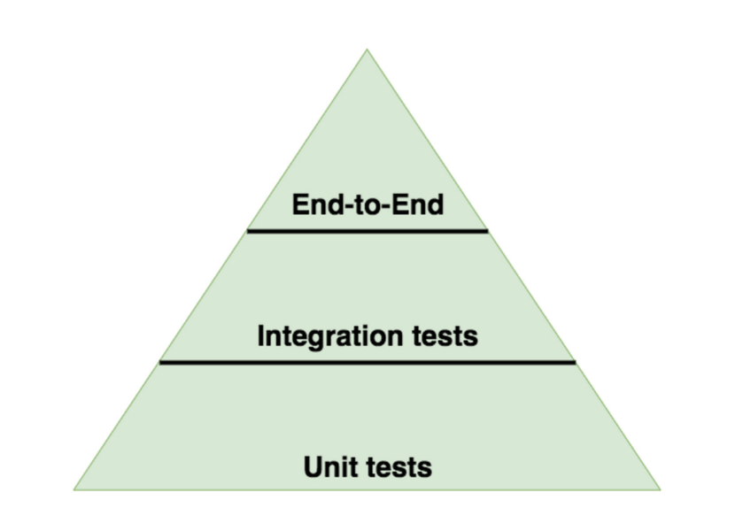

# МОДУЛЬНОЕ ТЕСТИРОВАНИЕ

В этой главе вы узнаете, что такое модульное тестировае (*или юнит-тестирование*) в Node.js, и как правильно тестировать ваши приложения.

## Тестирование Node.js-приложений

Вы можете думать о тестах как о гарантиях надёжности для приложений, которые вы пишите. Они будут запускаться не только на вашей локальной машине, но также и на CI-сервисах, чтобы сбойные сборки не попадали в продакшен.

>*«Тесты - это больше, чем просто гарантии, они обеспечивают живую документацию для вашей кодовой базы».*

Вы можете спросить: *что я должен протестировать в своем приложении? Сколько тестов у меня должно быть?*

Ответ варьируется в разных случаях, но, как правило, вы можете следовать рекомендациям, установленным **пирамидой тестирования**.



По сути, тестовая пирамида описывает, что вы должны писать **модульные тесты**, **интеграционные тесты** и **e2e тесты**. У вас должно быть больше интеграционных тестов, чем e2e и еще больше модульных тестов.

Давайте посмотрим, как вы можете добавить модульные тесты для своих приложений!

*Обратите внимание, что здесь мы не собираемся говорить об интеграционных и e2e тестах, поскольку они выходят далеко за рамки этого учебника.*

## Модульное тестирование Node.js приложений

Мы пишем модульные тесты для того, чтобы увидеть, работает ли данный модуль (юнит). Все зависимости обрезаны, что означает, что мы предоставляем поддельные зависимости (фейки) для модуля.

**Вы должны написать тесты для публичных методов, а не для внутренней реализации данного модуля.**

### Анатомия модульного теста

Каждый модульный тест имеет следующую структуру: 

1. Настройка теста
2. Вызов тестируемого метода
3. Утверждение

**В каждом модульном тесте должны проверяться только одна проблема.** *(Конечно, это не означает, что вы можете добавить только одно утверждение).*

### Библиотеки, используемые для тестирования в Node.js

Для модульного тестирования мы собираемся использовать следующие библиотеки:
• **запуск тестов**: [mocha](https://www.npmjs.com/package/mocha), альтернативно [tape](https://www.npmjs.com/package/tape)
• **библиотека утверждений**: [chai](http://chaijs.com/), альтернативно [assert](https://www.npmjs.com/package/assert) 
• **шпионы, стабы и моки**: [sinon](http://sinonjs.org/) *(для настройки тестов)*.

### Шпионы, стабы и моки - что использовать и когда?

Прежде чем приступить к практике модульного тестирования, давайте разберёмся, что такое шпионы, заглушки и моки!

### Шпионы

Вы можете использовать шпионов для получения информации о вызовах функций, например, сколько раз они были вызваны или какие аргументы были им переданы.

```javascript
it('calls subscribers on publish', function () {
    var callback = sinon.spy()
    PubSub.subscribe(‘message’, callback)
    
    PubSub.publishSync('message')
    assertTrue(callback.called)
})
// Пример взят из документации Sinon: http://sinonjs.org/docs/
```

### Стабы

Стабы *(или заглушки)* похожи на шпионов, но они заменяют целевую функцию. Вы можете использовать заглушки для управления поведением метода, чтобы форсировать какие-то события в коде (например, выброс ошибки) или предотвратить вызовы внешних ресурсов (таких как HTTP API).

```javascript
it(‘calls all subscribers, even if there are exceptions’, function (){
    var message = 'an example message'
    var error = 'an example error message'
    var stub = sinon.stub().throws()
    var spy1 = sinon.spy()
    var spy2 = sinon.spy()
    
    PubSub.subscribe(message, stub)
    PubSub.subscribe(message, spy1)
    PubSub.subscribe(message, spy2)
    
    PubSub.publishSync(message, undefined)
    
    assert(spy1.called)
    assert(spy2.called)
    assert(stub.calledBefore(spy1))
})
// Пример взят из документации Sinon: http://sinonjs.org/docs/
```

### Моки

Моки — это поддельные методы с заранее запрограммированным поведением и соглашениями.

```javascript
it(‘calls all subscribers when exceptions happen’, function () {
    var myAPI = {
        method: function () {}
    }

    var spy = sinon.spy()
    var mock = sinon.mock(myAPI)
    mock.expects(“method”).once().throws()

    PubSub.subscribe(“message”, myAPI.method)
    PubSub.subscribe(“message”, spy)
    PubSub.publishSync(“message”, unde ned)

    mock.verify()
    assert(spy.calledOnce)
})
// Пример взят из документации Sinon: http://sinonjs.org/docs/
```

Как вы можете видеть, для моков вы должны заранее определить соглашения.

Представьте, что вы хотите протестировать следующий модуль:

```javascript
const fs = require('fs')
const request = require('request')

function saveWebpage (url, filePath) {
    return getWebpage(url,  lePath)
        .then(writeFile)
}

function getWebpage (url) {
    return new Promise (function (resolve, reject) {
        request.get(url, function (err, response, body) {
            if (err) {
                return reject(err)
            }
            
            resolve(body)
        })
    })
}

function writeFile (fileContent) {
    let  lePath = ‘page’
    return new Promise (function (resolve, reject) {
        fs.writeFile(filePath, fileContent, function (err) {
            if (err) {
                return reject(err)
            }
            resolve(filePath)
        })
    })
}

module.exports = {
    saveWebpage
}
```

Этот модуль делает одну вещь: он сохраняет веб-страницу (основываясь на переданном URL) в файл на локальном компьютере. Чтобы протестировать этот модуль, мы должны застабить как модуль `fs`, так и модуль `request`.

Прежде чем начинать писать модульные тесты, в RisingStack обычно мы добавляем файл `test-setup.spec.js` для создания базовой настройки тестов, например создания песочниц Sinon. Это избавит вас от написания `sinon.sandbox.create()` и `sinon.sandbox.restore()` после каждого теста.

```javascript
// test-setup.spec.js
const sinon = require(‘sinon’)
const chai = require(‘chai’)

beforeEach(function () {
    this.sandbox = sinon.sandbox.create()
})

afterEach(function () {
    this.sandbox.restore()
})
```

Кроме того, обратите внимание, что мы всегда ставим файлы тестов рядом с реализацией и даём им имя вида `.spec.js`. В нашем `package.json` вы можете найти следующие строки:

```javascript
{
    "test-unit": "NODE_ENV=test mocha '/**/*.spec.js'",
}
```

Как только у нас появились эти настройки, пришло время написать сами тесты!

```javascript
const fs = require('fs')
const request = require('request')

const expect = require('chai').expect

const webpage = require('./webpage')

describe('The webpage module', function () {
    it('saves the content', function * () {
        const url = 'google.com'
        const content = '<h1>title</h1>'
        const writeFileStub = this.sandbox.stub(fs, 'writeFile', function ( filePath, fileContent, cb) {
            cb(null)
        })
        
        const requestStub = this.sandbox.stub(request, 'get', function (url, cb) {
            cb(null, null, content)
        })
        
        const result = yield webpage.saveWebpage(url)
        
        expect(writeFileStub).to.be.calledWith()
        expect(requestStub).to.be.calledWith(url)
        expect(result).to.eql(‘page’)
    })
})
```

Полные исходники примера вы можете найти здесь: [](https://github.com/RisingStack/nodehero-testing)

## Покрытие кода

Чтобы лучше понять, насколько хорошо ваша кодовая база покрыта тестами, вы можете сгенерировать отчет о покрытии.

Этот отчет будет включать следующие метрики:

* покрытие **строк кода**,
* покрытие **инструкций**,
* покрытие **ветвлений**,
* и покрытие **функций**.

В RisingStack мы используем [istanbul](https://github.com/gotwarlost/istanbul) для анализа покрытия кода. Вы должны добавить следующий скрипт к вашему `package.json`, чтобы использовать `istanbul` с `mocha`:

```
istanbul cover _mocha $(find ./lib -name \"*.spec.js\" -not -path \"./node_modules/*\")
```

Как только вы это сделаете, вы получите что-то вроде этого:


Вы можете кликнуть мышью, и на самом деле увидеть, что ваш исходный код аннотирован: какая часть протестирована, а какая — нет.

---

Тестирование может уберечь вас от множества неприятностей — тем не менее, неизбежно наступает время отладки. В следующей главе Node Hero вы узнаете, **как отлаживать Node.js-приложения**.
